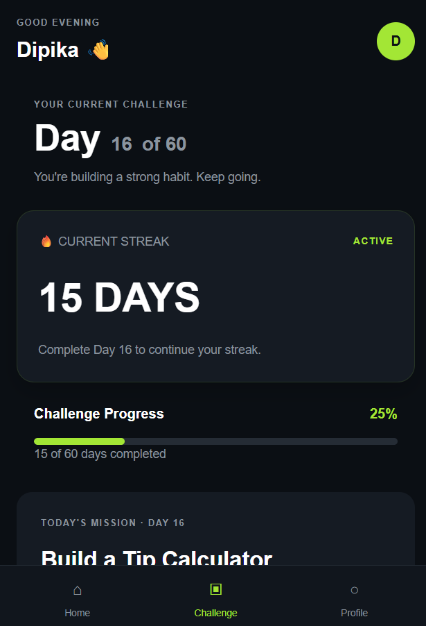
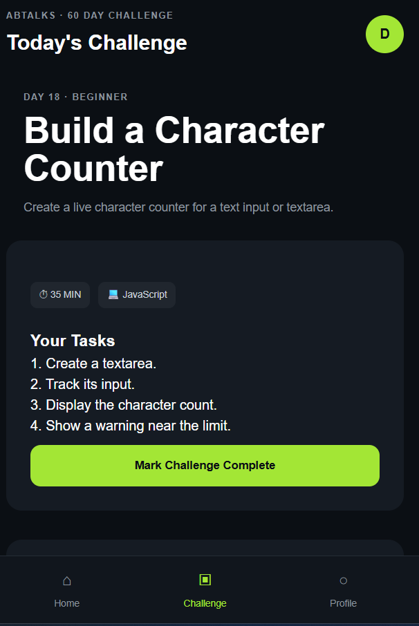
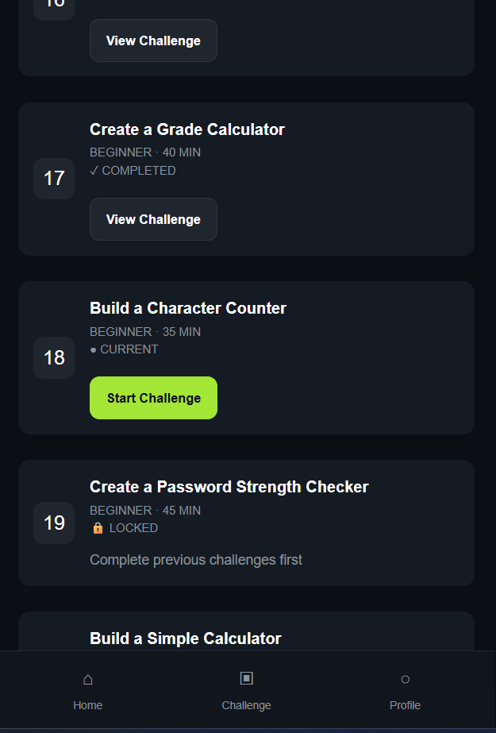
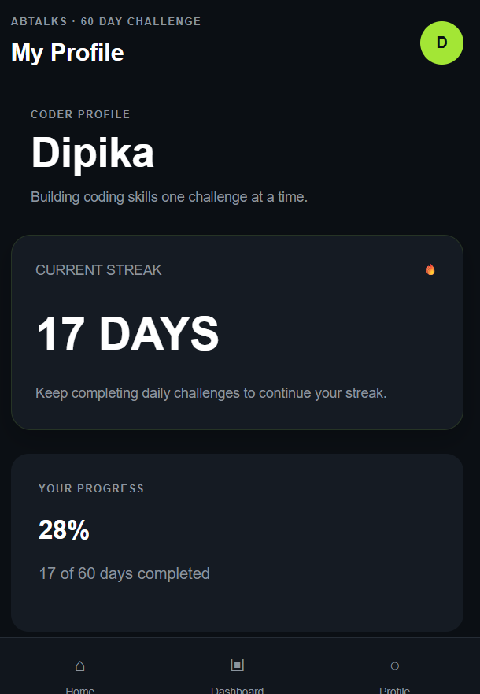
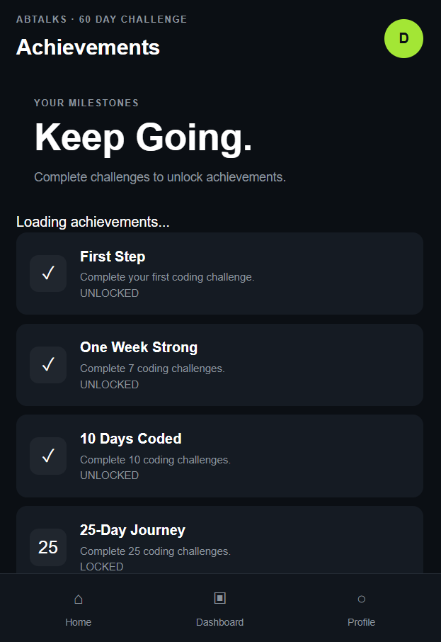

# ABTalks – 60-Day Coding Challenge

A web-based 60-day coding challenge designed to build consistent programming and web development skills through daily hands-on tasks.

## 🚀 Live Project

The project is deployed using GitHub Pages.

**Live Website:**  
https://dipika-debnath.github.io/abtalks-vibe-code/

## 📌 About the Project

ABTalks is a personal coding challenge platform where users progress through 60 daily coding challenges.

Each challenge provides:

- A challenge title
- Description
- Difficulty level
- Estimated completion time
- Recommended tools or technologies
- A list of tasks to complete

The application tracks the user's progress and updates the dashboard as challenges are completed.

## ✨ Features

### 60-Day Challenge System
- 60 structured coding challenges
- Beginner → Intermediate → Advanced progression
- Individual challenge pages
- Challenge status tracking

### Progress Tracking
- Current challenge
- Completed challenges
- Overall progress percentage
- Current coding streak
- Persistent progress using LocalStorage

### Challenge Explorer
- View all 60 challenges
- Completed challenges are marked
- Current challenge is highlighted
- Future challenges remain locked

### Profile
- Personal coder profile
- Current streak
- Challenge completion progress
- Current challenge status

### Achievements
- First Step
- One Week Strong
- 10 Days Coded
- 25-Day Journey
- Halfway There
- 60-Day Finisher

## 🛠️ Technologies Used

- HTML5
- CSS3
- JavaScript
- DOM Manipulation
- LocalStorage
- GitHub
- GitHub Pages

## 📂 Project Structure

```text
abtalks-vibe-code
│
├── index.html
├── dashboard.html
├── challenge.html
├── challenges.html
├── achievements.html
├── profile.html
│
├── challenges.js
├── script.js
├── style.css
│
└── README.md
```
## 📸 Screenshots

### Dashboard


### Today's Challenge


### All Challenges


### Profile


### Achievements

